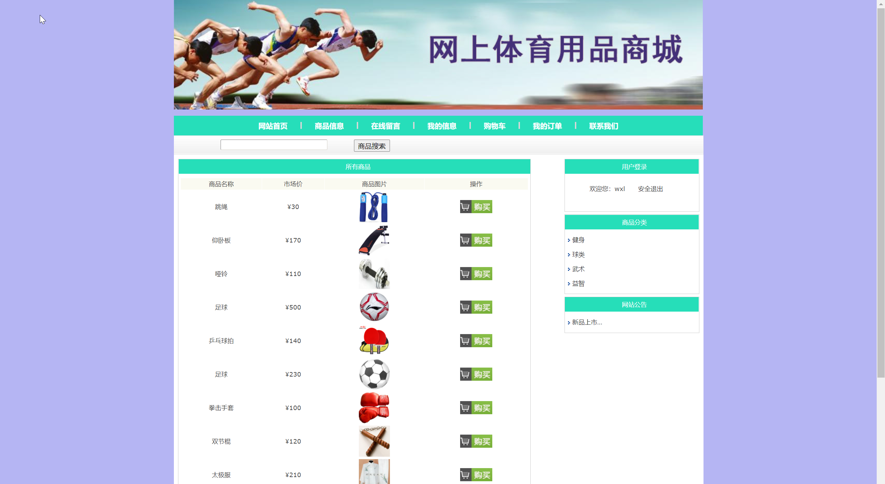
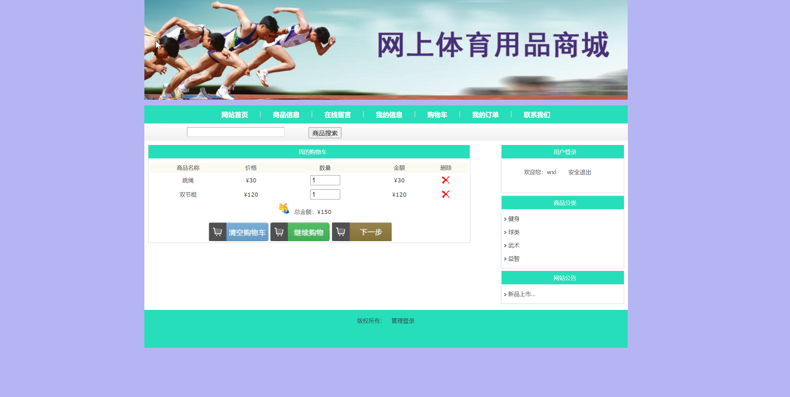
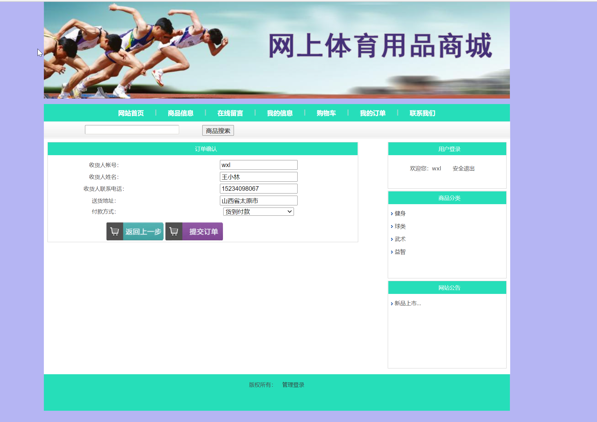
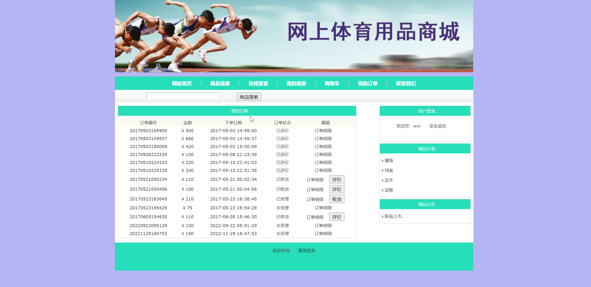
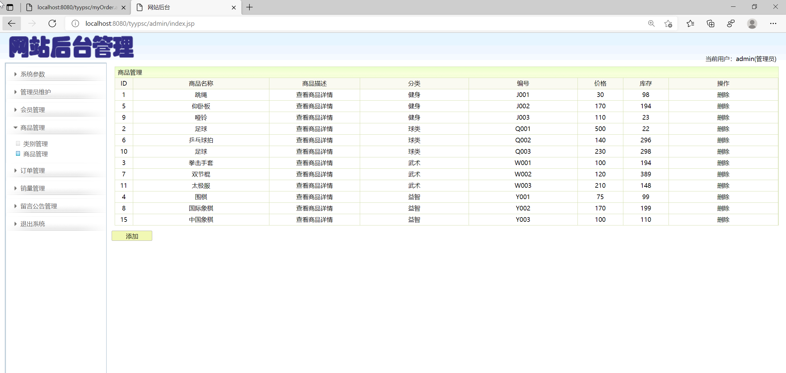
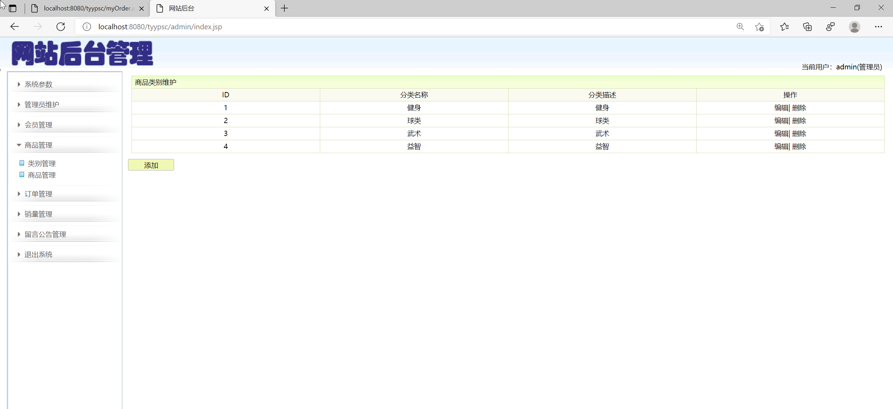

<h1 align="center">基于JSP+Servlet实现的网上体育商城</h1>

 获取sql文件 QQ: 605739993 QQ群: 377586148 

 [源码获取网站: 从戎源码网](https://armycodes.com/)

## 简介

> 本代码来源于网络,仅供学习参考使用!
>
> 提供1.远程部署/2.修改代码/3.设计文档指导/4.框架代码讲解等服务
>
> 管理员登录地址：http://localhost:8080/photoalbum/admin/
>
> 管理员: admin 密码: admin
>
> 用户登录地址：http://localhost:8080/photoalbum/
> 
> 用户：zhangsan 密码: 123

## 项目介绍

基于JSP+Servlet实现的网上体育商城的主要功能包括：前台用户登录退出、注册、在线购物、修改个人信息、
**（1）商品浏览模块：**
首页浏览最新上市商品，按销量排行显示商品
实现根据商品名称搜索商品信息
实现根据商品分类浏览商品
**（2）登录、注册：**
购物前需要登录，如果没有账号则可以先注册
**（3）在线留言：**
登录后可以发表留言
**（4）修改个人信息：**
登录后可修改个人信息
**（5）提交、查询订单：**
商品加入购物车后可以提交订单，也可以查看自己的所有订单
**（6）购物车模块：**
登录后可以查看自己购物车中的商品
**（7）后台管理员模块**
用户登录功能：通过账号登录系统。
修改登录密码功能：修改管理员的登录密码
会员管理功能：查询所有会员，删除会员
类别管理：查询所有类别，添加、修改、删除商品类别
商品管理：查询所有商品，添加、删除商品
订单管理：显示所有订单，查询订单明细，受理、删除订单
销量管理：查看所有商品的销量
留言管理：查看所有留言，删除留言
公告管理：查看所有公告，添加、删除公告

## 环境

- <b>IntelliJ IDEA 2020.3</b>

- <b>Mysql 5.7.26</b>

- <b>Tomcat 8.0.32</b>

- <b>JDK 1.8</b>

## 运行截图

